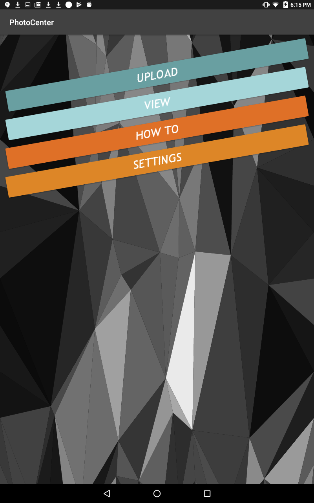
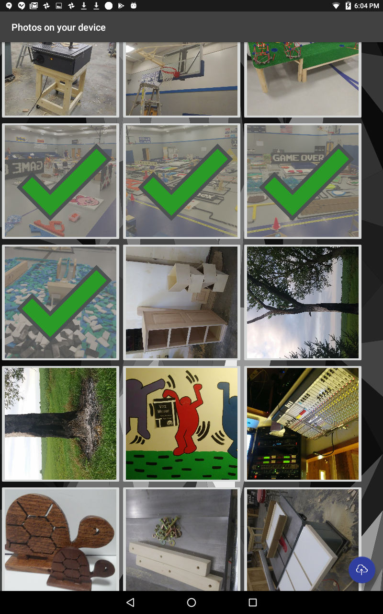
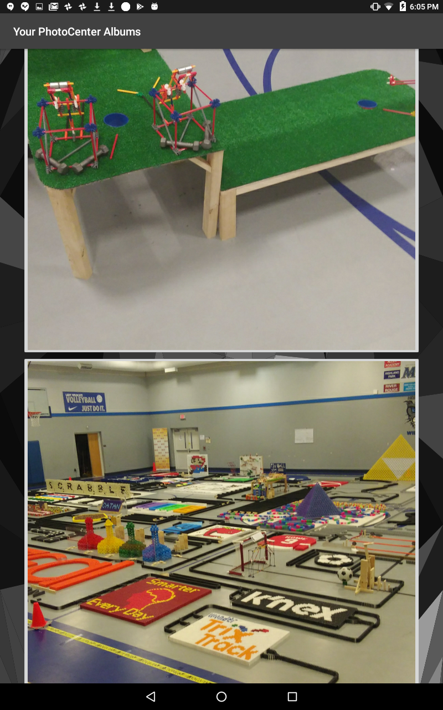

# HackISU Fall 2018 - Best in UI Design - PhotoCenter
#### Locally hosted Photo managment service with web interface and Android app
This app was built during a 36 hour long hackathon. It is fully functinoal and allows photo upload, storage, tagging, searching, and allows you to turn any device with a web browser into a picture frame. More information can be found about the project on the [DevPost](https://devpost.com/software/photocenter-he1ajs).
#### This Repository contains the Android App
For the server and web interface go to [this repository](https://github.com/maxdevos49/Fall2018Hackathon)
## About

This app allows uploading any photo stored on your device to the server. It doesn't support tagging. Photos uploaded from the app will be placed into the `General` album. The `View` page will displays all of the albums stored remotely on the server. Clicking one will display all of the photos in that album.

  
  
  

## Getting Started
For the purposes of devlopment during the 36 hour time limit deployment of this app is done through android studio.

> 1. In order to use this you will need to setup your own [server](https://github.com/maxdevos49/Fall2018Hackathon).  
> 2. Open the project in Android Studio and follow [this guide](https://github.com/maxdevos49/Fall2018Hackathon) to deploy the app to your Android device.  
> 3. Open the settings page and enter your server information: <i>http://<b>\<Server IP\></b>:<b>\<Server Port\><b></i> and save.  
> 4. You should now have a connection to upload and view photos on the server
